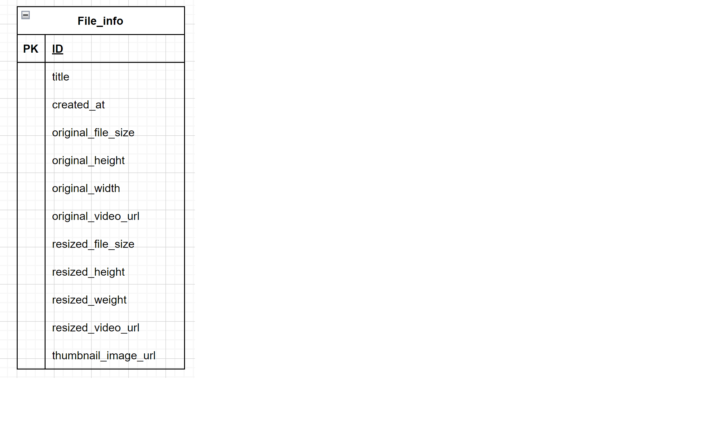
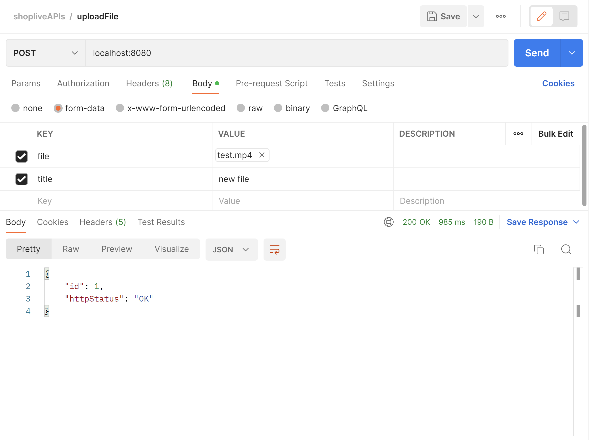
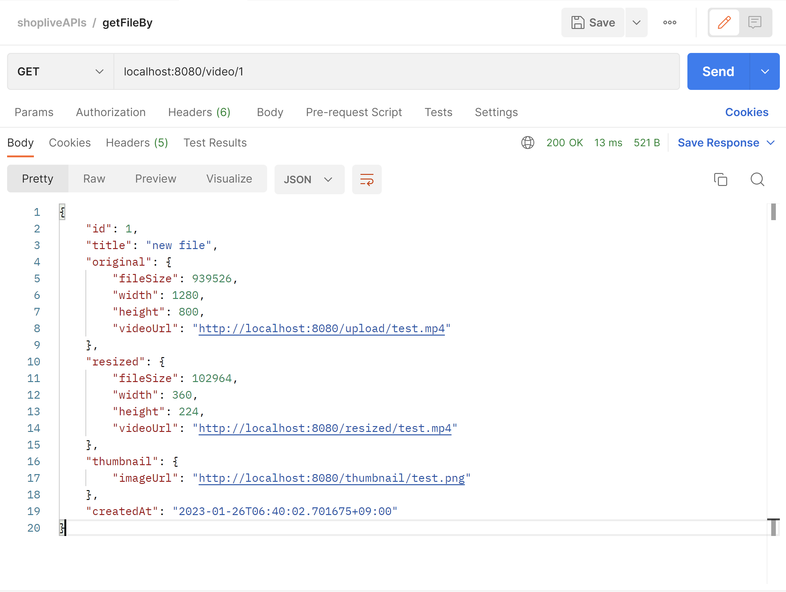

## Title

shoplive assignment

## Description

### Application purpose

* 영상 업로드 후 사이즈 변환 및 첫 장면 썸네일 추출기능을 제공하는 API. 

### Technologies
* Java 17
* Spring
* Gradle
* H2 Database
* JPA
* FFmpeg
* Lombok
* Docker

### Constraints
* Windows OS 사용자로 가정. 
* 서버 C:\PATH_Programs에 ffmpeg.exe, ffplay.exe, ffprobe.exe 설치되어있다 가정. 
* 업로드 파일 포맷 mp4로 제한.
* 업로드 최대 용량 100MB 제한.
* 변환 파일 포맷은 mp4. 
* 썸네일 파일 포맷은 png.

### Details
* http://localhost:8080/ 에서 구동
* 영상 상세 정보 조회 API 통해 받은 url로 이동하면 static resource 접근.
* 변환 작업은 비동기적으로 실행.
* 개발편의를 위해 서버 재시작시 storage reset.

## DB
### ERD


### Description
* original_video_url
  * 업로드 영상 static resource url
* resized_video_url
  * 변환 영상 static resource url 
* thumbnail_image_url
  * 썸네일 static resource url

## API request & response sample
### 영상 업로드 및 변환 API

### 영상 상세정보 조회 API

## Installation

```bash
$ 
```

## Running the app

```bash
$ 

```
